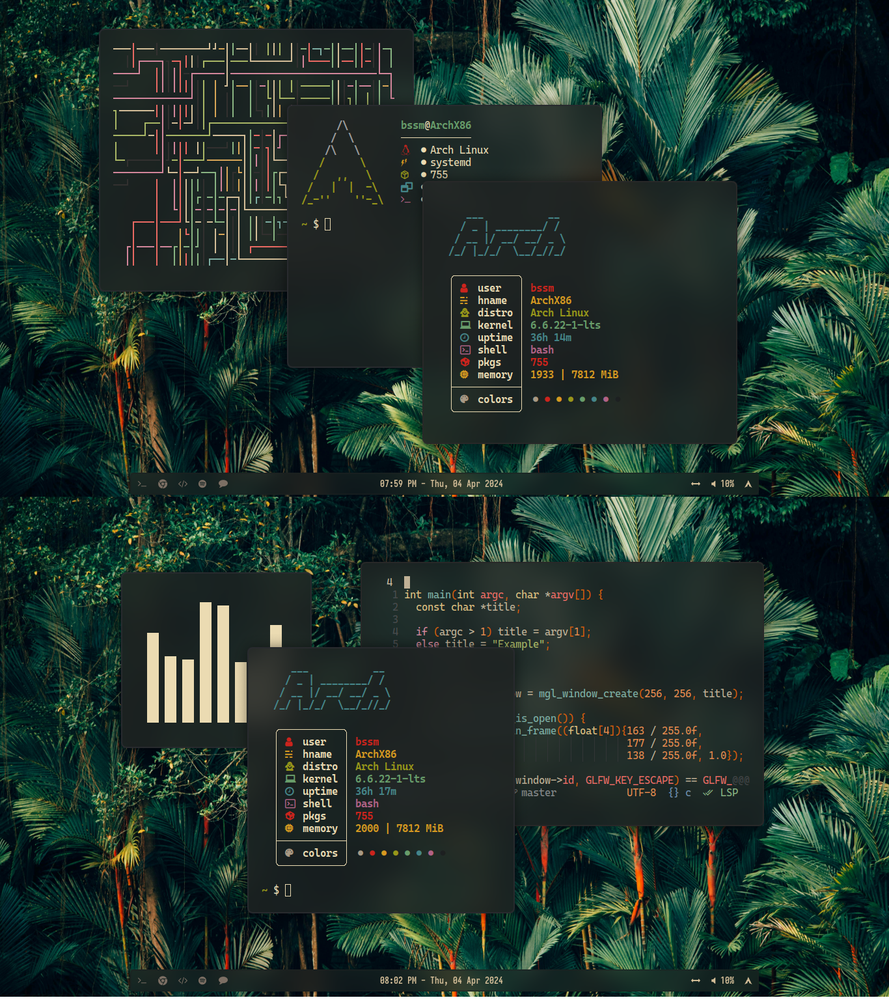

# MinimalSwayFX
Minimal configuration for [swayFX](https://github.com/WillPower3309/swayfx), a great tiling wayland window manager.
It's made so people don't waste there time creating there own configs. That may take hours.
It's a minimal config so you might add new features on top of it. If you like, than you shall add a pull 
request for your config too.

## Screenshots
| Showcase                       |
| -----------------------------  |
|   |

## Dependencies
The current repo depends on these programs. So, if you want everything to just work, install these:
```
sway (or swayfx),
swaybg,
swayidle,
swaylock,
swayimg,
alacritty,
fish,
waybar,
i3status-rust (if you don't intent to use waybar),
neofetch,
mako,
nvim,
tofi,
eza,

[font] CaskaydiaCove Nerd Font
```

## Configuration Details
This configuration has a status bar at the top (Waybar), a menu to open up apps(Tofi). It uses the 
[Nerd Font](https://www.nerdfonts.com/) versions of [Cascadia Code](https://github.com/microsoft/cascadia-code).
For the terminal & UI, The main theme used here is the [Gruvbox Material](https://github.com/sainnhe/gruvbox-material) color scheme.

The programs that are used to this configuration:
- SwayFX, as the core window manager.
- [Alacritty](https://github.com/alacritty/alacritty) for the terminal. 
  The themes are from [Alacritty-Theme](https://github.com/alacritty/alacritty-theme)
- [Mako](https://github.com/emersion/mako), as the notification daemon.
- [Tofi](https://github.com/philj56/tofi), as the application launcher. Also, has given the gruvchad theme from NvChad.
- [Waybar](https://github.com/Alexays/Waybar), for fancy status bar.
- Swaybar & [i3status](https://github.com/i3/i3status), for static minimal status bar.
- Wallpapers, got some dark forest and sunny forest wallpapers from [Pexels](https://www.pexels.com) & [Unsplash](https://unsplash.com/).

## Contribution
If you want to contribute to the project, add a star to it. And if you want to change something project just go ahead and create a pull request. If your request is praiseworthy, I will merge it. Thanks to everybody who is using this!
