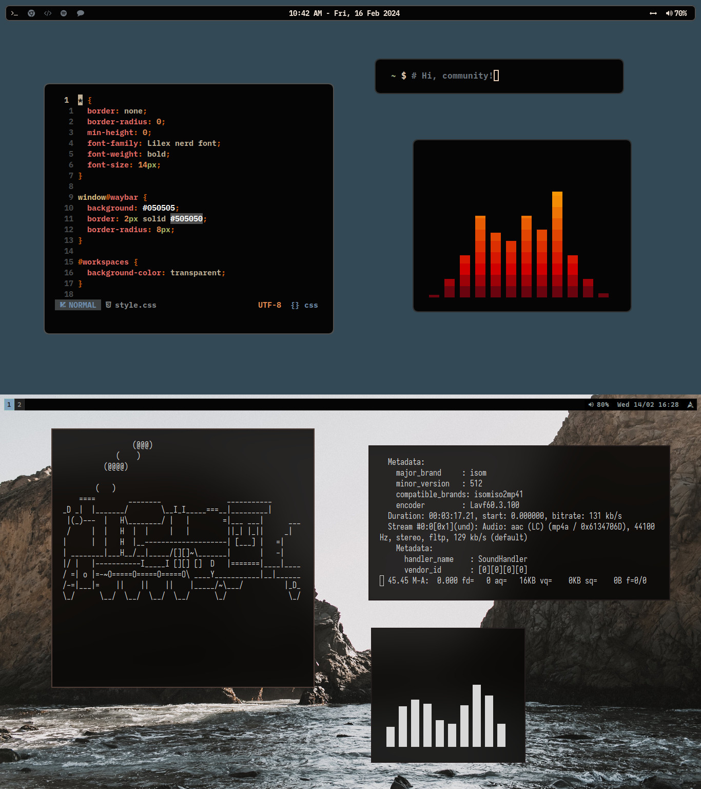
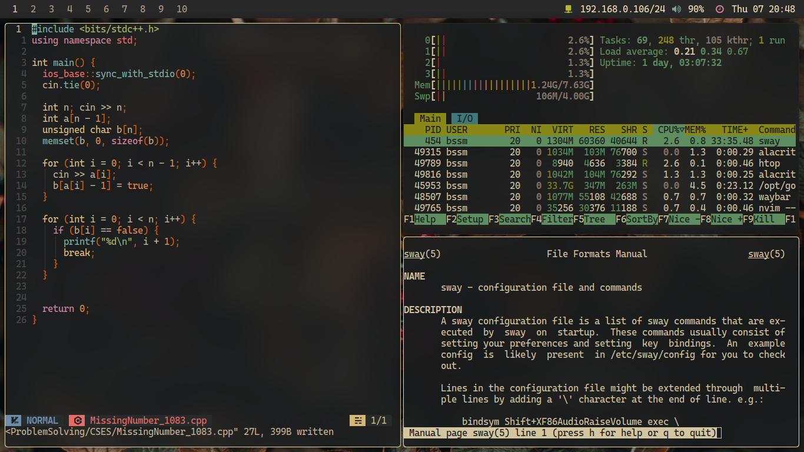

# MinimalSwayFX

Minimal configuration for [swayFX](https://github.com/WillPower3309/swayfx), a great tiling wayland window manager.
It's made so people don't waste there time creating there own configs. That may take hours.
It's a minimal config so you might add new features on top of it. If you like, than you shall add a pull 
request for your config too.

## Screenshots
| Idle                          | Coding                            |
| ----------------------------- | --------------------------------- |
|  |  |

## Configuration Details
This configuration has a status bar at the top (Waybar), a menu to open up apps(Tofi). It uses the 
[Nerd Font](https://www.nerdfonts.com/) versions of [Cascadia Code](https://github.com/microsoft/cascadia-code) 
for the terminal & UI. The main theme used here is the Tomorrow Night version of 
[Tomorrow Theme](https://github.com/chriskempson/tomorrow-theme) color scheme.

The programs that are used to this configuration:
- SwayFX, as the core window manager.
- [Alacritty](https://github.com/alacritty/alacritty) for the terminal. 
  The themes are from [Alacritty-Theme](https://github.com/alacritty/alacritty-theme)
- [Mako](https://github.com/emersion/mako), as the notification daemon.
- [Tofi](https://github.com/philj56/tofi), as the application launcher.
- [Waybar](https://github.com/Alexays/Waybar), as the status bar.
- Wallpapers, got some dark forest and sunny forest wallpapers from [Pexels](https://www.pexels.com).

If your curios what tools are used to create the "Coding Screenshot", they are as follows
neovim with [NvChad](https://github.com/NvChad/NvChad), Htop and the man page of sway(5).

## Installation
Run the `install.sh` file. If you have already some configuration. They will be saved as `config_name.bak` as a folder.

## Contribution
If you want to contribute to the project, add a star to it. And if you want to change something
project just go ahead and create a pull request. If your request is praiseworthy, I will merge it.
Thanks to everybody who is using this!
